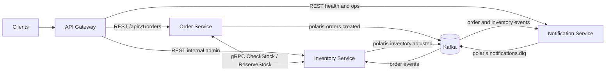

# Polaris

[](#)
[](#)
[](#)
[](#)

Polaris is a production-grade microservices blueprint for a small e-commerce order flow. It is designed as a portfolio anchor: one repository that demonstrates REST at the edge, gRPC between services, Kafka for event choreography, database-per-service persistence, Liquibase migrations, containerized local development, observability, CI, and deployable Kubernetes artifacts.

## Architecture



## Stack

| Layer             | Choice                                       |
|-------------------|----------------------------------------------|
| Build             | Maven multi-module                           |
| Java              | 25                                           |
| Spring Boot       | 3.4.x                                        |
| Spring Cloud      | 2024.0.x                                     |
| Database          | PostgreSQL 16, one database per service      |
| Schema migrations | Liquibase                                    |
| Async messaging   | Apache Kafka 3.7                             |
| Internal RPC      | gRPC + Protobuf                              |
| Auth              | Spring Security + JWT OAuth2 resource server |
| Testing           | JUnit 5, Mockito, Testcontainers             |
| Metrics           | Micrometer, Prometheus, Grafana              |
| Tracing           | OpenTelemetry, Jaeger                        |
| Logs              | SLF4J + Logback, ELK-ready structured output |
| Container runtime | Docker, Docker Compose                       |
| Orchestration     | Kubernetes manifests and Helm chart          |
| CI                | GitHub Actions and CodeQL                    |

## Modules

| Module                 | Responsibility                                                                    |
|------------------------|-----------------------------------------------------------------------------------|
| `shared`               | Shared DTOs, events, exceptions, and cross-service support code                   |
| `gateway`              | Spring Cloud Gateway routes, JWT validation, CORS, rate limiting, request logging |
| `order-service`        | Order REST API, order lifecycle, Postgres persistence, Kafka event publishing     |
| `inventory-service`    | gRPC inventory API, stock reservations, inventory persistence, Kafka consumers    |
| `notification-service` | Kafka-driven notification workflow with retry and dead-letter handling            |

## Quick Start

Prerequisites:

- Java 25
- Maven 3.9.6 or newer
- Docker with Docker Compose

Run the full local stack from the repository root:

```bash
docker-compose up --build
```

Expected local endpoints once the service skeleton and compose stack are in place:

| Service                       | URL                                     |
|-------------------------------|-----------------------------------------|
| Gateway                       | `http://localhost:8080`                 |
| Order Service actuator        | `http://localhost:8081/actuator/health` |
| Inventory Service actuator    | `http://localhost:8082/actuator/health` |
| Notification Service actuator | `http://localhost:8083/actuator/health` |
| Prometheus                    | `http://localhost:9090`                 |
| Grafana                       | `http://localhost:3000`                 |
| Jaeger                        | `http://localhost:16686`                |

Build and verify all modules:

```bash
./mvnw clean verify
```

If the Maven wrapper has not been generated yet:

```bash
mvn clean verify
```

## Domain Flow

1. A client places an order through the gateway.
2. `order-service` persists the order as `PENDING`.
3. `order-service` calls `inventory-service` over gRPC to check and reserve stock.
4. `order-service` publishes `polaris.orders.created` to Kafka.
5. `inventory-service` consumes order events and updates stock projections.
6. `notification-service` consumes order and inventory events and emits notification logs.

## Production Conventions

- Each service owns its database and schema migrations.
- REST is used for external traffic through the gateway.
- gRPC is used for synchronous internal service contracts.
- Kafka carries durable domain events and supports eventual consistency.
- Services expose health, readiness, metrics, tracing, and structured logs.
- Integration tests use Testcontainers, not shared developer infrastructure.
- Docker Compose is the default local runtime; Helm is the deployment contract.
- ADRs in `docs/adr` document major architectural decisions.

## Roadmap

- `v0.1.0`: repository skeleton, architecture docs, parent build.
- `v0.2.0`: order, inventory, and notification service skeletons.
- `v0.3.0`: Docker Compose end-to-end order flow.
- `v0.4.0`: gateway auth, observability, CI, and integration tests.
- `v1.0.0`: Helm chart, deployment docs, completed ADR set.

## License

Polaris is licensed under the Apache License, Version 2.0. See `LICENSE` for details.
