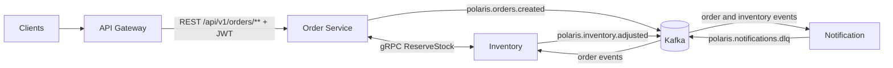

# Polaris

[](https://github.com/abdullahsayed30/Polaris/actions/workflows/ci.yml)
[](https://github.com/abdullahsayed30/Polaris/actions/workflows/codeql.yml)
[](#)
[](#)
[](#)

Polaris is a production-oriented reference implementation of a small e-commerce order flow. It is designed as a portfolio anchor: the repository contains runnable services, an authenticated local demo, integration and contract tests, observability assets, container builds, and a Helm deployment contract. It demonstrates production patterns without claiming that a sample repository operates a production platform.

Order, inventory and notification use a [Hombergs-style hexagonal architecture](docs/service-architecture-standard.md): inbound/outbound ports, pure business models and separate JPA persistence adapters. Gateway and contract modules retain their existing structure.

## Architecture


```mermaid
flowchart LR
    Client[Clients] --> Gateway[API Gateway]

    Gateway -->|REST /api/v1/orders/** + JWT| Order[Order Service]

    Order <-->|gRPC ReserveStock| Inventory

    Order -->|polaris.orders.created| Kafka[(Kafka)]
    Inventory -->|polaris.inventory.adjusted| Kafka
    Notification -->|polaris.notifications.dlq| Kafka

    Kafka -->|order events| Inventory
    Kafka -->|order and inventory events| Notification
```

## Stack

| Layer             | Choice                                       |
|-------------------|----------------------------------------------|
| Build             | Maven multi-module                           |
| Java              | 25                                           |
| Spring Boot       | 3.5.x                                        |
| Spring Cloud      | 2025.0.x                                     |
| Database          | PostgreSQL 18, one database per stateful service |
| Schema migrations | Liquibase                                    |
| Async messaging   | Spring Kafka; Kafka 3.7.2 in local Compose   |
| Internal RPC      | gRPC + Protobuf                              |
| Auth              | JWT resource servers; local Keycloak realm   |
| Testing           | JUnit 5, Mockito, Testcontainers             |
| Metrics           | Micrometer, Prometheus, Grafana              |
| Tracing           | OpenTelemetry, Grafana Tempo                 |
| Logs              | SLF4J + Logback, ELK-ready structured output |
| Container runtime | Docker, Docker Compose                       |
| Orchestration     | Helm-rendered Kubernetes resources           |
| CI                | GitHub Actions, CodeQL, Trivy, JaCoCo, SBOMs |

## Modules

| Module                 | Responsibility                                                                    |
|------------------------|-----------------------------------------------------------------------------------|
| [`proto-contracts`](docs/proto-contracts.md) | Versioned protobuf contracts and generated gRPC Java stubs                        |
| [`shared`](docs/shared.md) | Shared Java event payloads used by Kafka producers and consumers                  |
| `contract-tests`       | Cross-service HTTP, event, and protobuf compatibility checks                      |
| `gateway`              | Spring Cloud Gateway routes, JWT validation, CORS, rate limiting, request logging |
| `order-service`        | Order REST API, order lifecycle, Postgres persistence, Kafka event publishing     |
| `inventory-service`    | Starter-managed gRPC inventory API, stock reservations, inventory persistence, Kafka consumers |
| `notification-service` | Idempotent Kafka notification workflow with a persistent inbox, retry, and dead-letter handling |

## Gateway Edge Contract

The gateway is the external HTTP entry point. It exposes the public order API at `/api/v1/orders/**`, validates bearer JWTs as an OAuth2 resource server, handles CORS preflight requests, logs each request with an `X-Request-Id`, and applies a global rate limit. The default rate limiter is in-memory for local development; the `docker` profile switches the backend to Redis.

| Route ID | Method | Public path | Upstream |
| --- | --- | --- | --- |
| `order-create` | `POST` | `/api/v1/orders` | `order-service:8081` |
| `order-read` | `GET` | `/api/v1/orders/{orderId}` | `order-service:8081` |
| `order-public-api` | Any | `/api/v1/orders/**` | `order-service:8081` |

See [Gateway](docs/services/gateway.md) for configuration details.

## Quick Start

For the fastest reviewer path, install:

- Java 25
- Maven Wrapper, pinned to Maven 3.9.15
- Docker with Docker Compose
- `curl` and `jq` for the authenticated demo

Verify the codebase, start the local stack, and run the customer-isolation demo:

```bash
./mvnw clean verify
docker compose up --build --wait
./demo/polaris-demo.sh
```

The demo obtains local Keycloak tokens for two users, places and reads an order through the gateway, and verifies that one customer cannot read another customer's order. The realm, users, passwords, and password-grant flow are development fixtures only; see [Local authenticated demo](demo/README.md).

Useful local endpoints:

| Service                       | URL                                     |
|-------------------------------|-----------------------------------------|
| Gateway                       | `http://localhost:8080`                 |
| Local Keycloak realm          | `http://localhost:8089/realms/polaris` |
| Order Service actuator        | `http://localhost:8081/actuator/health` |
| Inventory Service actuator    | `http://localhost:8082/actuator/health` |
| Inventory Service gRPC        | `localhost:19090`                       |
| Notification Service actuator | `http://localhost:8083/actuator/health` |
| Prometheus                    | `http://localhost:9090`                 |
| Grafana                       | `http://localhost:3000`                 |
| Tempo API                     | `http://localhost:3200`                 |

Run the fast local gate without Testcontainers-backed integration tests:

```bash
./mvnw spotless:check checkstyle:check test
```

Configure the required local Git hooks once per clone:

```bash
git config core.hooksPath .githooks
git config --get core.hooksPath
```

The pre-commit hook runs the fast local gate: Spotless, Checkstyle, and unit tests. CI also runs integration tests, coverage, CodeQL, repository and container scans, image smoke tests, and SBOM generation. It builds production images but does not publish them. See [CI/CD](docs/ci-cd.md).

Review the Kubernetes output without needing a cluster:

```bash
./deploy/scripts/validate-helm.sh
```

The chart deploys application workloads only. PostgreSQL, Kafka, Redis, OIDC/JWKS, and telemetry endpoints are supplied by the target platform. See [Kubernetes deployment](docs/deployment.md) and [Operational readiness](docs/operations.md).

## Domain Flow

1. A client places an order through the gateway.
2. `order-service` commits a `PENDING` order and its stable reservation identity before calling inventory.
3. It calls `ReserveStock` directly. Inventory commits its idempotent decision and any inventory adjustment outbox row atomically.
4. Order commits the confirmed/cancelled outcome and its order event outbox row atomically. A recovery worker retries unfinished orders with the same identity after lost responses or crashes, without requiring a client retry.
5. Outbox publishers deliver the stored events to Kafka. Notification deduplicates them with its own inbox and logs simulated notifications; no real email is sent.

`CheckStock` remains an informational API, and `ReleaseStock` is an explicit compensation primitive. Neither is a preliminary step in order placement. See [reservation recovery](docs/adr/0020-recover-pending-orders-durably.md).

## Production Conventions

- Order, inventory, and notification each own a PostgreSQL database and Liquibase migrations; the gateway remains stateless.
- REST is used for external traffic through the gateway.
- Gateway API routes require JWT authentication; health and CORS preflight traffic stay unauthenticated.
- gRPC is used for synchronous internal service contracts.
- gRPC server lifecycle, client stubs, health checks, local reflection, interceptors, metrics, and tracing are managed through the Spring Boot-compatible gRPC starter.
- Kafka carries durable domain events and supports eventual consistency.
- Services expose health, readiness, metrics, OTLP tracing, ECS JSON logs, and request correlation.
- Integration tests use Testcontainers, not shared developer infrastructure.
- CI enforces Java 25, formatting, style, unit tests, integration tests, static analysis, and repository security scans.
- Docker Compose is the local demo runtime; Helm is the application deployment contract and deliberately excludes production stateful infrastructure.
- ADRs in `docs/adr` document major architectural decisions.

Agent contributors must follow [`AGENTS.md`](AGENTS.md). Fast tests include package-boundary checks alongside Maven's runtime module dependency enforcement.

Detailed service documentation lives in [`docs/services`](docs/services/README.md), observability conventions live in [`docs/observability.md`](docs/observability.md), and the ADR index lives in [`docs/adr`](docs/adr/README.md).

## Delivery status and roadmap

The Maven application version is `0.8.0`; the Helm chart is independently versioned from `0.1.0`. This is a capability roadmap, not a claim that matching Git tags or published artifacts exist.

Available in this checkout:

- Four runnable services with REST, gRPC, Kafka, service-owned PostgreSQL state where needed, Liquibase, and actuator telemetry.
- Docker Compose local runtime with development-only identity, seeded data, Prometheus, Grafana, and Tempo.
- Maven integration/contract tests plus CI quality, security, container, coverage, and SBOM gates.
- A Helm chart with probes, resource controls, security contexts, PDBs, optional HPAs, NetworkPolicies, and external infrastructure contracts.

Next operational increments:

- Publish immutable image digests and packaged charts from a release workflow.
- Add rendered-manifest policy/security validation to CI without coupling cluster credentials to pull requests.
- Add measured business metrics for order acceptance, reservation outcomes, notification age, and DLQ growth before formalizing business SLOs.
- Rehearse database restore, Kafka replay, schema-compatible rollback, and zone-failure behavior in a target environment.

## License

Polaris is licensed under the Apache License, Version 2.0. See `LICENSE` for details.
