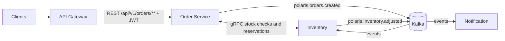

# Polaris Architecture

Polaris models a small e-commerce order flow with a gateway and three independently deployable services. The project is intentionally compact, but the architecture uses the same production patterns expected in larger service estates: database per service, explicit API boundaries, asynchronous domain events, internal RPC contracts, containerized local development, and documented architecture decisions.

## Services

| Service | Role |
| --- | --- |
| [Gateway](services/gateway.md) | Edge routing, JWT validation, CORS, request logging, and rate limiting |
| [Order Service](services/order-service.md) | Public order API, order lifecycle, orchestration, and order event publishing |
| [Inventory Service](services/inventory-service.md) | Stock checks over gRPC, inventory reservations, stock persistence, inventory events |
| [Notification Service](services/notification-service.md) | Asynchronous event consumer for confirmation, inventory, retry, and dead-letter handling |
| [Proto Contracts](proto-contracts.md) | Versioned protobuf contracts and generated gRPC Java stubs |
| [Shared](shared.md) | Shared Java event payloads used by Kafka producers and consumers |

## Communication Patterns

External clients enter through Spring Cloud Gateway over REST. The gateway owns edge concerns such as authentication, CORS, rate limiting, and request correlation so that service implementations stay focused on domain behavior. The current public route surface is `/api/v1/orders/**`, which forwards to `order-service`.

Synchronous internal calls use gRPC where a request needs an immediate answer, such as checking stock before confirming an order. gRPC keeps internal contracts explicit, strongly typed, and efficient without exposing those APIs to external clients.

Kafka carries domain events that do not require an immediate response. Order creation, inventory adjustments, and notification outcomes are modeled as durable events so services can evolve independently and recover from transient failures.

## Gateway Edge Policy

The gateway validates bearer JWTs with Spring Security's OAuth2 resource server support. The local default uses static issuer and JWKS URLs until the identity provider runtime is added. Health, info, and CORS preflight requests are public; order API routes require an authenticated JWT.

Gateway CORS, upstream URI, and rate-limit settings are externalized. Local development uses an in-memory fixed-window limiter, while the Docker profile selects Redis-backed fixed-window limiting. See [Gateway](services/gateway.md) for route and configuration details.

## Data Ownership

Each service owns its PostgreSQL database and applies Liquibase migrations as part of its deployment lifecycle. Cross-service reads happen through APIs or events, not shared tables. This keeps service boundaries visible and makes operational ownership clear.

## Why These Choices

- Maven multi-module keeps the blueprint easy to build while preserving service boundaries.
- Java 25 sets the runtime baseline for the blueprint.
- PostgreSQL 18 is the transactional database baseline for service-owned data.
- Liquibase makes schema evolution reviewable and repeatable.
- Kafka demonstrates event-driven choreography and eventual consistency.
- gRPC demonstrates internal synchronous contracts without leaking them to the edge.
- Testcontainers makes integration tests realistic and portable in CI.
- GitHub Actions, CodeQL, Trivy, Spotless, Checkstyle, and repository-managed Git hooks keep build, security, and style gates repeatable.
- Prometheus, Grafana, OpenTelemetry, Tempo, and ELK-ready logs show production observability expectations.
- Kubernetes manifests and Helm chart make deployment intent clear without requiring a permanent paid environment.

## ADR Index

- [ADR Index](adr/README.md)
- [0001 - Record Architecture Decisions](adr/0001-record-architecture-decisions.md)
- [0002 - Use Maven Multi-Module and Java 25 Baseline](adr/0002-use-maven-multi-module-and-java-25-baseline.md)
- [0003 - Use Database Per Service](adr/0003-use-database-per-service.md)
- [0004 - Use SQL-Based Liquibase Migrations](adr/0004-use-sql-based-liquibase-migrations.md)
- [0005 - Use Ports-and-Adapters Service Structure](adr/0005-use-ports-and-adapters-service-structure.md)
- [0006 - Use gRPC and Protobuf for Internal RPC](adr/0006-use-grpc-and-protobuf-for-internal-rpc.md)
- [0007 - Package Protobuf Contracts in a Dedicated Module](adr/0007-package-protobuf-contracts-in-a-dedicated-module.md)
- [0008 - Use Kafka for Domain Event Choreography](adr/0008-use-kafka-for-domain-event-choreography.md)
- [0009 - Publish Domain Events After Transaction Commit](adr/0009-publish-domain-events-after-transaction-commit.md)
- [0010 - Use Reservation Flow Instead of Distributed Transactions](adr/0010-use-reservation-flow-instead-of-distributed-transactions.md)
- [0011 - Use Testcontainers for Integration Tests](adr/0011-use-testcontainers-for-integration-tests.md)
- [0012 - Use Spring Cloud Gateway as the Edge Service](adr/0012-use-spring-cloud-gateway-as-the-edge-service.md)
- [0013 - Use JWT OAuth2 Resource Server at the Gateway](adr/0013-use-jwt-oauth2-resource-server-at-the-gateway.md)
- [0014 - Use Notification Retry and Dead-Letter Topic](adr/0014-use-notification-retry-and-dead-letter-topic.md)
- [0015 - Use Records for Configuration Properties](adr/0015-use-records-for-configuration-properties.md)
- [0016 - Use Tempo for Distributed Tracing](adr/0016-use-tempo-for-distributed-tracing.md)
- [0017 - Use GitHub Actions Quality and Security Gates](adr/0017-use-github-actions-quality-and-security-gates.md)

## Service Documentation

Detailed runtime service documentation lives under [Services](services/README.md).

## Service Code Standard

Polaris services follow a lightweight ports-and-adapters architecture. The package and dependency rules are documented in [Service Architecture Standard](service-architecture-standard.md).

## Contract Packaging

Polaris keeps protobuf definitions in a versioned Maven module named `proto-contracts`. Services consume generated gRPC stubs through that artifact instead of copying `.proto` files or reading another service's source tree. See [Proto Contracts](proto-contracts.md).
