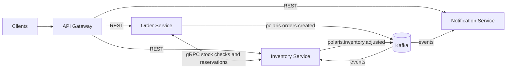

# Polaris Architecture

Polaris models a small e-commerce order flow with a gateway and three independently deployable services. The project is intentionally compact, but the architecture uses the same production patterns expected in larger service estates: database per service, explicit API boundaries, asynchronous domain events, internal RPC contracts, containerized local development, and documented architecture decisions.

## Services

| Service | Role |
| --- | --- |
| Gateway | Edge routing, JWT validation, CORS, request logging, and rate limiting |
| Order Service | Public order API, order lifecycle, orchestration, and order event publishing |
| Inventory Service | Stock checks over gRPC, inventory reservations, stock persistence, inventory events |
| Notification Service | Asynchronous event consumer for confirmation and inventory notifications |
| Shared | Shared contracts, common error models, events, protobuf stubs, and utility code |

## Communication Patterns

External clients enter through Spring Cloud Gateway over REST. The gateway owns edge concerns such as authentication, CORS, rate limiting, and request correlation so that service implementations stay focused on domain behavior.

Synchronous internal calls use gRPC where a request needs an immediate answer, such as checking stock before confirming an order. gRPC keeps internal contracts explicit, strongly typed, and efficient without exposing those APIs to external clients.

Kafka carries domain events that do not require an immediate response. Order creation, inventory adjustments, and notification outcomes are modeled as durable events so services can evolve independently and recover from transient failures.

## Data Ownership

Each service owns its PostgreSQL database and applies Liquibase migrations as part of its deployment lifecycle. Cross-service reads happen through APIs or events, not shared tables. This keeps service boundaries visible and makes operational ownership clear.

## Why These Choices

- Maven multi-module keeps the blueprint easy to build while preserving service boundaries.
- Java 25 sets the runtime baseline for the blueprint.
- PostgreSQL 16 is a practical default for transactional service data.
- Liquibase makes schema evolution reviewable and repeatable.
- Kafka demonstrates event-driven choreography and eventual consistency.
- gRPC demonstrates internal synchronous contracts without leaking them to the edge.
- Testcontainers makes integration tests realistic and portable in CI.
- Prometheus, Grafana, OpenTelemetry, Jaeger, and ELK-ready logs show production observability expectations.
- Kubernetes manifests and Helm chart make deployment intent clear without requiring a permanent paid environment.

## ADR Index

- [0001 - Record Architecture Decisions](adr/0001-record-architecture-decisions.md)
- 0002 - Use gRPC for internal synchronous calls
- 0003 - Database per service
- 0004 - Event-driven choreography with Kafka
- 0005 - Saga for multi-service transactions
