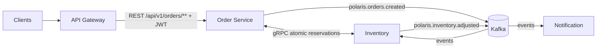
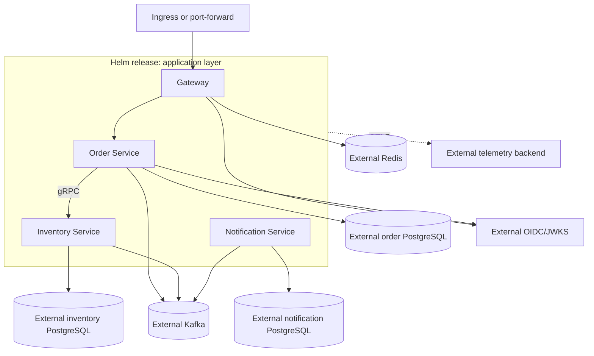

# Polaris Architecture

Polaris models a small e-commerce order flow with a gateway and three independently deployable services. The project is intentionally compact, but it keeps explicit API boundaries, asynchronous domain events, internal RPC contracts, state ownership, containerized local development, and documented architecture decisions visible.

```mermaid
flowchart LR
    Client[Clients] --> Gateway[API Gateway]

    Gateway -->|REST /api/v1/orders/** + JWT| Order[Order Service]

    Order <-->|gRPC atomic reservations| Inventory

    Order -->|polaris.orders.created| Kafka[(Kafka)]
    Inventory -->|polaris.inventory.adjusted| Kafka
    Kafka -->|events| Inventory
    Kafka -->|events| Notification
```

## Services

| Service | Role |
| --- | --- |
| [Gateway](services/gateway.md) | Edge routing, JWT validation, CORS, request logging, and rate limiting |
| [Order Service](services/order-service.md) | Public order API, order lifecycle, orchestration, and order event publishing |
| [Inventory Service](services/inventory-service.md) | Stock checks over gRPC, inventory reservations, stock persistence, inventory events |
| [Notification Service](services/notification-service.md) | Asynchronous event consumer for confirmation, inventory, retry, and dead-letter handling |
| [Proto Contracts](proto-contracts.md) | Versioned protobuf contracts and generated gRPC Java stubs |
| [Shared](shared.md) | Shared Java event payloads used by Kafka producers and consumers |

## Communication Patterns

External clients enter through Spring Cloud Gateway over REST. The gateway owns edge concerns such as authentication, CORS, rate limiting, and request correlation so that service implementations stay focused on domain behavior. The current public route surface is `/api/v1/orders/**`, which forwards to `order-service`.

Synchronous internal calls use gRPC where a request needs an immediate answer, such as atomically reserving stock before confirming an order. Order placement does not check then reserve. It commits a pending intent first and recovers uncertain reservation results with the same identity, as described in ADR 0020. gRPC keeps internal contracts explicit, strongly typed, and efficient without exposing those APIs to external clients.

Spring Boot-compatible gRPC starters own server lifecycle and client channel creation. Services add global gRPC interceptors for request ID propagation, access logs, Micrometer Observation, and Prometheus metrics. Inventory exposes gRPC health and enables reflection only in local and Docker runtime profiles.

Kafka carries domain events that do not require an immediate response. Order creation, inventory adjustments, and notification outcomes are modeled as durable events so services can evolve independently and recover from transient failures.

## Deployment Boundary

```mermaid
flowchart TB
    Ingress[Ingress or port-forward] --> Gateway

    subgraph Chart[Helm release: application layer]
        Gateway --> Order[Order Service]
        Order -->|gRPC| Inventory[Inventory Service]
        Notification[Notification Service]
    end

    Order --> OrderDB[(External order PostgreSQL)]
    Inventory --> InventoryDB[(External inventory PostgreSQL)]
    Notification --> NotificationDB[(External notification PostgreSQL)]
    Gateway --> Redis[(External Redis)]
    Gateway --> OIDC[External OIDC/JWKS]
    Order --> OIDC
    Order --> Kafka[(External Kafka)]
    Inventory --> Kafka
    Notification --> Kafka
    Chart -. OTLP .-> Telemetry[External telemetry backend]
```

The Helm chart owns application Deployments, Services, configuration, Secret references, probes, resource/security settings, disruption budgets, optional autoscaling, and NetworkPolicies. PostgreSQL, Kafka, Redis, identity, certificates, backups, and telemetry storage remain platform responsibilities. This keeps the repository honest about the operational work needed to run stateful systems.

## Observability

Services expose actuator health and Prometheus metrics. Docker Compose enables OTLP trace export to Tempo, while direct local JVM runs keep trace export disabled unless explicitly enabled. Console logs use ECS JSON and include trace identifiers plus `request.id` when request context exists.

Grafana provisions Prometheus and Tempo datasources, the Polaris overview dashboard, and a dedicated Polaris gRPC dashboard. See [Observability](observability.md) for runtime conventions.

## Gateway Edge Policy

The gateway validates bearer JWTs with Spring Security's OAuth2 resource server support. Docker Compose includes a development-only Keycloak realm for the local demo; Kubernetes values require an operator-supplied issuer and JWKS endpoint. Health, info, and CORS preflight requests are public; order API routes require an authenticated JWT.

Gateway CORS, upstream URI, and rate-limit settings are externalized. Local development uses an in-memory fixed-window limiter, while the Docker profile selects Redis-backed fixed-window limiting. See [Gateway](services/gateway.md) for route and configuration details.

## Data Ownership

Order, inventory, and notification each own a PostgreSQL database and apply Liquibase migrations as part of application startup. Notification uses its database as a durable inbox for idempotent event processing; it does not share order or inventory tables. Cross-service reads happen through APIs or events, not shared tables.

## Why These Choices

- Maven multi-module keeps the blueprint easy to build while preserving service boundaries.
- Java 25 sets the runtime baseline for the blueprint.
- PostgreSQL 18 is the transactional database baseline for service-owned data.
- Liquibase makes schema evolution reviewable and repeatable.
- Kafka demonstrates event-driven choreography and eventual consistency.
- gRPC demonstrates internal synchronous contracts without leaking them to the edge.
- Testcontainers makes integration tests realistic and portable in CI.
- GitHub Actions, CodeQL, Trivy, Spotless, Checkstyle, and repository-managed Git hooks keep build, security, and style gates repeatable.
- Prometheus, Grafana, OpenTelemetry, Tempo, and ELK-ready logs show production observability expectations.
- The Helm chart renders Kubernetes application resources while externalizing production stateful infrastructure and credentials.

## ADR Index

- [ADR Index](adr/README.md)
- [0001 - Record Architecture Decisions](adr/0001-record-architecture-decisions.md)
- [0002 - Use Maven Multi-Module and Java 25 Baseline](adr/0002-use-maven-multi-module-and-java-25-baseline.md)
- [0003 - Use Database Per Service](adr/0003-use-database-per-service.md)
- [0004 - Use SQL-Based Liquibase Migrations](adr/0004-use-sql-based-liquibase-migrations.md)
- [0005 - Use Ports-and-Adapters Service Structure](adr/0005-use-ports-and-adapters-service-structure.md)
- [0006 - Use gRPC and Protobuf for Internal RPC](adr/0006-use-grpc-and-protobuf-for-internal-rpc.md)
- [0007 - Package Protobuf Contracts in a Dedicated Module](adr/0007-package-protobuf-contracts-in-a-dedicated-module.md)
- [0008 - Use Kafka for Domain Event Choreography](adr/0008-use-kafka-for-domain-event-choreography.md)
- [0009 - Publish Domain Events After Transaction Commit](adr/0009-publish-domain-events-after-transaction-commit.md)
- [0010 - Use Reservation Flow Instead of Distributed Transactions](adr/0010-use-reservation-flow-instead-of-distributed-transactions.md)
- [0011 - Use Testcontainers for Integration Tests](adr/0011-use-testcontainers-for-integration-tests.md)
- [0012 - Use Spring Cloud Gateway as the Edge Service](adr/0012-use-spring-cloud-gateway-as-the-edge-service.md)
- [0013 - Use JWT OAuth2 Resource Server at the Gateway](adr/0013-use-jwt-oauth2-resource-server-at-the-gateway.md)
- [0014 - Use Notification Retry and Dead-Letter Topic](adr/0014-use-notification-retry-and-dead-letter-topic.md)
- [0015 - Use Records for Configuration Properties](adr/0015-use-records-for-configuration-properties.md)
- [0016 - Use Tempo for Distributed Tracing](adr/0016-use-tempo-for-distributed-tracing.md)
- [0017 - Use GitHub Actions Quality and Security Gates](adr/0017-use-github-actions-quality-and-security-gates.md)
- [0018 - Use Spring Boot-Compatible gRPC and Observability Conventions](adr/0018-use-spring-boot-compatible-grpc-and-observability-conventions.md)
- [0019 - Use Transactional Outbox and Consumer Inbox](adr/0019-use-transactional-outbox-and-consumer-inbox.md)
- [0020 - Recover Pending Orders Durably](adr/0020-recover-pending-orders-durably.md)

## Service Documentation

Detailed runtime service documentation lives under [Services](services/README.md).

## Service Code Standard

Polaris services follow a lightweight ports-and-adapters architecture. The package and dependency rules are documented in [Service Architecture Standard](service-architecture-standard.md).

## Contract Packaging

Polaris keeps protobuf definitions in a versioned Maven module named `proto-contracts`. Services consume generated gRPC stubs through that artifact instead of copying `.proto` files or reading another service's source tree. See [Proto Contracts](proto-contracts.md).
