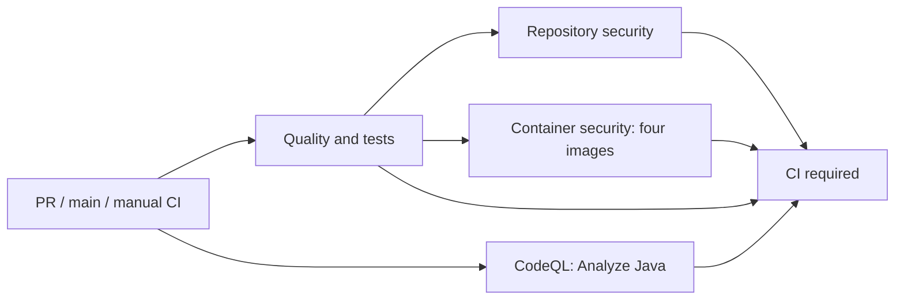

# CI/CD

Polaris uses GitHub Actions as the project quality and security gate. The build is intentionally pinned to Java 25, and the Maven Wrapper is pinned to Maven 3.9.15 so local and CI behavior match.

## Active Gates

| Gate | Tool | Purpose |
| --- | --- | --- |
| Formatting | Spotless | Java formatting, import ordering, trailing whitespace, and final newlines |
| Style | Checkstyle | Import hygiene, package declarations, braces, naming, and service boundary checks |
| Unit tests | Maven Surefire | Fast non-container tests |
| Integration tests | Maven Failsafe + Testcontainers | PostgreSQL, Kafka, HTTP, and gRPC integration behavior |
| Coverage | JaCoCo | Per-module HTML and XML line coverage reports plus a CI job summary |
| Static analysis | CodeQL | Java security and quality analysis |
| Repository security | Trivy | Dependency, secret, Dockerfile, Compose, and configuration scanning |
| Container security | Docker + Trivy | Production image build, archive smoke test, and image vulnerability scanning |
| Software bill of materials | CycloneDX + Trivy | Aggregate Maven dependency SBOM and one SBOM for each production image |
| Local hooks | Git `core.hooksPath` | Required pre-commit Spotless, Checkstyle, and unit test gate |

The main workflow orchestrates four reusable responsibilities and a final `CI required` check. This is a project layout choice, not a mandated enterprise standard. GitHub supports same-commit reusable workflows in the flat `.github/workflows` directory; it does not support workflow subdirectories. See [reusable workflows](https://docs.github.com/en/actions/how-tos/reuse-automations/reuse-workflows).

## Workflow Map

| File | Responsibility | Trigger / dependency |
| --- | --- | --- |
| `ci.yml` | Orchestration, concurrency and `CI required` | PRs targeting main, pushes to main, manual runs |
| `reusable-ci.yml` | Style, architecture/contract/unit tests, Testcontainers, packaging, coverage and dependency SBOM | Called by CI as `quality` |
| `reusable-repository-security.yml` | Dependency, secret and configuration scanning; full reports and severity enforcement | Called after quality succeeds |
| `reusable-container-security.yml` | Four production Dockerfile builds, archive smoke tests, image reports/SBOMs and severity enforcement | Called after quality succeeds, independently of repository security |
| `codeql.yml` | Instrumented Java build and static analysis | Called by CI; standalone weekly Monday 03:23 UTC and manual runs |



`CI required` runs with `always()` and requires explicit success from all four caller jobs. Failure, cancellation, a skipped dependency, missing results or a disabled integration-test input makes it fail. Matrix `fail-fast: false` keeps the other service scans running when one image fails. A cancelled workflow can leave its final check cancelled; it cannot establish success. Manual fast runs remain available for diagnosis and intentionally cannot pass `CI required`.

All CI triggers run the complete required graph without path filters. Obsolete non-main runs are cancelled within the same event/ref; main runs are retained. Quality, images and CodeQL have 45-minute timeouts, repository security 20 minutes, and the aggregate 5 minutes. The CodeQL reusable workflow has a separate concurrency group so it cannot cancel its caller.

## Check Names and Adoption

| Before | After |
| --- | --- |
| `ci / Quality gates` (tests and repository security combined) | `quality / Quality and tests` and `repository-security / Repository security` |
| `ci / Container image (<service>)` | `container-security / Container security (<service>)` |
| Standalone `Analyze Java` on PR/main | `static-analysis / Analyze Java` in CI; standalone `Analyze Java` for weekly/manual scans |
| No overall job | `CI required` |

The 2026-10-07 read-only audit of main rules found PR, deletion and non-fast-forward rules, with no required-status-check rule. No repository settings are changed by this PR. If required checks are configured before adoption, an authorized administrator must update the old names to the observed new names after testing. `CI required` is the proposed required status; GitHub Code Scanning policy is a separate repository setting and is not replaced by this job. Preserve any separately required security result.

Only `artifact-name` and `run-integration-tests` remain as quality-workflow inputs. The unused `java-version` and arbitrary `maven-args` inputs are retired; external callers must remove them. Java stays fixed at the accepted 25 baseline.

The open Dependabot Actions PR #3 edits checkout/setup-java tags in `codeql.yml` and `reusable-ci.yml`. This cleanup pins the currently used major versions to verified upstream commit SHAs rather than incorporating that version upgrade. Rebase or regenerate #3 against the reorganized files before considering it; do not merge its stale layout automatically.

## Local Commands

Use the Maven Wrapper from the repository root:

```bash
./mvnw spotless:check checkstyle:check test
./mvnw verify
```

Configure the required local hooks once per clone:

```bash
git config core.hooksPath .githooks
git config --get core.hooksPath
```

The checked-in `.githooks/pre-commit` hook runs `./mvnw -B -ntp spotless:check checkstyle:check test`. `./mvnw test` excludes `*IntegrationTest` classes. `./mvnw verify` runs integration tests and requires Docker for Testcontainers.

## Trivy Scope

Three responsibilities explain the visible Trivy results:

1. **Execution:** Trivy scans repository content, its resolved dependency SBOM, or an image and produces full-severity JSON results. A scanner/database failure fails the job even though findings use `exit-code: 0` at this stage.
2. **Enforcement:** `trivy convert --severity HIGH,CRITICAL --exit-code 1` filters that native JSON result and fails for vulnerability, secret or misconfiguration findings. It does not parse SARIF or run another scan.
3. **Reporting:** conversion creates full-severity SARIF; `upload-sarif` submits it for GitHub Code Scanning processing. The resulting Code Scanning status/alerts are a separate responsibility, not evidence of another scan workflow. Stable categories distinguish repository and each image's results. See [GitHub SARIF uploads](https://docs.github.com/en/code-security/how-tos/find-and-fix-code-vulnerabilities/integrate-with-existing-tools/upload-sarif-file).

Native JSON and SARIF artifacts upload before severity enforcement, so HIGH/CRITICAL findings do not hide lower-severity reports. SARIF upload is best effort because fork/Dependabot PR tokens and repository configuration can limit Code Scanning access; the native severity gate and downloadable reports still run. Upload errors remain visible in logs. Every scan and mandatory conversion must succeed; only the Code Scanning upload is allowed to continue on error. Reports run after earlier step failures when a result exists, avoiding unnecessary work after cancellation.

Repository security scans source content and, separately, the aggregate dependency SBOM downloaded from the **same workflow run** using the dedicated `trivy sbom` command. The source scan enables secrets/misconfigurations with `--pkg-types os --offline-scan`, disabling irrelevant Maven library resolution while retaining source secret/configuration analysis; all Maven dependency vulnerabilities come from the already resolved SBOM. This avoids resolving Maven POMs again on a runner with an empty Maven cache, which triggered Maven Central HTTP 429 in the initial split-job run. The manifest checks the tested `github.sha`, workflow run ID and SBOM SHA-256; missing, altered or mismatched provenance fails. [Trivy 0.74 disables SBOM analysis in `fs`](https://github.com/aquasecurity/trivy/blob/v0.74.0/pkg/commands/artifact/run.go#L222-L227), so merely downloading an SBOM into the source tree does not scan it. A tiny database-free regression scan checks inventory discovery through `trivy sbom`. Complete native finding records from both scans are combined before SARIF/severity conversion; schema/tool-version mismatch or missing SBOM inventory fails. Raw source/dependency JSON remains in the artifact. Downloads never specify another run, branch or external repository. A failed-job rerun can reuse an earlier successful quality artifact from the same run and SHA. This is source binding within one workflow, not a signed supply-chain attestation.

After quality succeeds, CI builds the production target of every service Dockerfile from the same checkout, smoke-tests its Java runtime and executable Spring Boot archive, and applies the same severity policy. JSON includes the package inventory used to convert each image SBOM. The smoke test does not establish application startup or cluster health. Checked-in Helm source is scanned; main CI does not lint, render, schema-validate or scan rendered Kubernetes manifests. Those local checks live in `deploy/scripts/validate-helm.sh`; a future release workflow should scan the actual promoted output.

[Trivy's supported JSON conversion](https://trivy.dev/docs/latest/configuration/reporting/#converting) reduces a successful four-image pipeline from 14 target scans (two repository, three per image) to six (one source, one dependency SBOM, one per image), removing eight repeated scans while explicitly covering the resolved dependency inventory. SARIF, CycloneDX and severity conversion use the same scan snapshot. The quality job uses `verify` for tests, packaging and coverage in one reactor instead of separate test, integration, package and success-path coverage invocations. The aggregate dependency SBOM remains a separate Maven goal and explicitly includes test scope, so scanning the resolved graph covers the CI test classpath as well as runtime dependencies. Image SBOMs describe the actual production image inventory. See [CycloneDX scope options](https://cyclonedx.github.io/cyclonedx-maven-plugin/makeAggregateBom-mojo.html#includeTestScope).

Four Dockerfile builds are retained to verify that every independently deployable production recipe can build from source; they include Maven packaging with tests skipped. CodeQL keeps its own instrumented build because downloading ordinary JARs does not replace extraction. This PR removes repeated security scans, not those five builds. No elapsed-time or billing saving is claimed: separate runners add checkout/artifact overhead and image work now remains visible when repository security fails.

## Workflow Security

The default token is `contents: read`; only repository/image security and CodeQL callers/jobs request `actions: read` and `security-events: write`. Checkout does not persist credentials. No secrets are inherited, no images are pushed, and no deployment credentials are needed. PRs use `pull_request`, never privileged `pull_request_target` or `workflow_run` with PR code. All external actions are pinned to upstream full commit SHAs with version comments for Dependabot review. These choices follow [GitHub secure-use guidance](https://docs.github.com/en/actions/reference/security/secure-use). They do not change GitHub token, branch or Code Scanning settings.

## Current Dependency Blocker

The 2026-10-07 audit of main `32c0ab9` found [CI run 37530937717](https://github.com/abdullahsayed30/Polaris/actions/runs/37530937717) failed its repository severity gate after style, tests, packaging and SBOM/report uploads succeeded; image jobs were skipped by the old combined dependency. [CodeQL run 37530937453](https://github.com/abdullahsayed30/Polaris/actions/runs/37530937453) passed, and the Code Scanning API recorded one repository Trivy analysis rather than a duplicate workflow.

The template PR screenshot showed `Code scanning results / Trivy` as neutral with “4 configurations not found,” plus a skipped `Container image (${{ matrix.service }})` placeholder. Main's prior successful scans recorded `trivy-image-gateway`, `trivy-image-order-service`, `trivy-image-inventory-service` and `trivy-image-notification-service`; the failing main/template runs recorded only `trivy-repository`. This evidence supports the four missing configurations being the skipped image analyses, rather than a second Trivy workflow or malformed interpolation. GitHub shows the unexpanded matrix name when the job is skipped before expansion. The cleanup preserves all five Trivy categories and explicitly preserves the existing CodeQL category; moving jobs does not intentionally reset analysis identities.

Trivy/GitHub advisory data classifies Spring WebMVC 6.2.19's CVE-2026-47884 as CRITICAL. The [official Spring advisory](https://spring.io/security/cve-2026-47884/) rates it MEDIUM, describes XsltView-specific conditions, and lists 6.2.20 as Enterprise Support Only and 7.0.9 as the public fix. This cleanup retains HIGH/CRITICAL gates and introduces no CVE exclusions or dependency overrides. Remediation or a time-bounded exception requires a separate reviewed decision with advisory-source policy, applicability evidence, owner, expiry and reassessment; absence of an application API reference alone is not an approved exception. A Boot/Spring major upgrade is separate work.

Production targets use the digest-pinned Temurin Java 25 Alpine JRE for both amd64 and arm64. This replaces the Debian 13 Distroless runtime whose base reported eight HIGH Expat and util-linux findings in the 2026-09-30 scan. The selected Alpine base contains Expat 2.8.5 and does not include util-linux. The image still runs as UID/GID 65532, matching Helm, and the HIGH/CRITICAL gate remains unchanged with no vulnerability exclusions. Dependabot tracks the tagged digest so runtime security updates remain reviewable.

The root POM imports Jackson BOM 2.21.7 before the Spring Boot BOM to apply the 2.21 security patches consistently across runtime JSON modules. The 2026-10-05 CI scan identified five HIGH findings across `jackson-core` and `jackson-databind` in Spring Boot 3.5.16's managed 2.21.4 version. Keep the explicit override until the managed baseline includes those fixes; retained-event and exact-decimal contract tests remain part of the gate.

Alpine uses musl rather than glibc and includes a shell and package manager; it is not a shell-free runtime. Validate application startup and native-library compatibility when updating the base, in addition to the archive smoke test. The local-runtime target continues to serve the Compose demo.

Dependabot checks Maven dependencies, GitHub Actions, Docker Compose images, and each service Dockerfile every week. CI artifacts retain test and coverage reports for 14 days and SBOMs for 30 days.

## Deferred Deployment Automation

The enterprise-style deployment workflow is intentionally documented but not active in the current CI scope. Later deployment releases should add:

- Semantic version calculation for release and snapshot branches.
- Git tag creation for release builds.
- Container image publish (CI already builds and scans images without pushing them).
- Helm chart packaging and publish.
- Helm lint/render, Kubernetes schema validation, and Trivy scanning of rendered manifests.
- Optional ArgoCD deployment promotion once target clusters and credentials exist.
