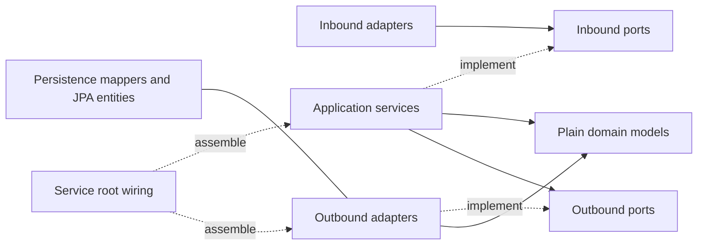

# Service Architecture Standard

Order, inventory and notification use Tom Hombergs' hexagonal (ports-and-adapters) structure, following [BuckPal at the pinned reference commit](https://github.com/thombergs/buckpal/tree/dc819c66640be4f42100a622b9e97b1e82ad75a7). [ADR 0021](adr/0021-adopt-hombergs-hexagonal-service-structure.md) supersedes ADR 0005 for these three services. Gateway, shared contracts and generated protobuf code are outside this migration.

## Package Standard

All paths below are relative to `io.polaris.<service>`:

| Package | Responsibility |
| --- | --- |
| `application.domain.model` | Plain business models, state transitions, invariants and value types; no JPA or framework dependencies |
| `application.domain.service` | Use-case implementations, orchestration, business transactions and plain policy values |
| `application.port.in` | Inbound use-case interfaces, inputs/results and public use-case exceptions |
| `application.port.out` | Application-owned storage, client, event, delivery and telemetry capabilities |
| `adapter.in.web`, `.grpc`, `.messaging` | Request/record decoding, validation, response/error mapping and inbound-port calls |
| `adapter.in.scheduling` | Scheduled recovery triggers that call an inbound port |
| `adapter.out.persistence` | JPA entities, Spring Data repositories, mappers, storage adapters and transactional inbox/outbox recording |
| `adapter.out.grpc`, `.messaging` | Outbound RPC and Kafka delivery, including outbox delivery bookkeeping |
| `adapter.out.observability`, `.retry`, `.logging` | Existing telemetry, retry mechanics and simulated notification handling |
| Service root | Bootstrap, Spring wiring, typed configuration properties and shared adapter correlation constants |

Only packages with actual responsibilities exist. Notification has no artificial business model: inbox rows are infrastructure bookkeeping. No capability wrapper, extra runtime Maven module or Spring Modulith dependency is required.

## Dependency Direction

- Inbound adapters invoke ports; they do not reference use-case implementation classes or outbound adapters.
- Application services may use Spring `@Service`/`@Component`, transaction annotations and SLF4J logging. These are deliberate BuckPal-style conveniences. They must not use Spring Data, JPA, transport types, concrete adapters, Micrometer, Resilience4j or bound configuration records.
- Models depend on their own model types, JDK types and stable shared contracts only. Ports may also refer to other ports. Neither imports application services or infrastructure.
- Root configuration translates Spring-bound properties into plain application policy where needed. Generated gRPC types stay at adapter/wiring boundaries; order's inventory port exposes its own plain decision enum.
- Runtime services remain independent deployables and database owners. Generated `io.polaris.inventory.grpc` contracts are the only inventory namespace permitted in another service. `shared` stays framework-free contracts and small value types.

## Persistence and Transactions

Domain objects are snapshots, never managed JPA entities. Loading a model, mutating it and returning from a transaction does not persist that change. Use cases explicitly call storage ports to write state. Persistence adapters map onto existing managed entities, preserve IDs and child ownership, check optimistic versions and flush before returning. Mappers retain decimal precision/scale, creation timestamps and version information; JPA lifecycle callbacks update persistence timestamps. Returned saved models include the flushed version and update timestamp.

Storage ports join the caller's transaction. Reservation and order locks remain held through that transaction; adapters must not commit independently. The read-only recovery scan selects candidate IDs, then each resolution acquires its lock in a new business transaction.

- **Order:** commit pending intent and customer-bound idempotency identity before inventory mutation. Resolve by stable order ID; lock, reserve, explicitly save final state/request outcome and enqueue the outbox event in one local transaction. Recover uncertain results using the same identity (ADR 0020).
- **Inventory:** insert/lock the order reservation, lock SKU rows in deterministic order, apply plain-model transitions, explicitly store stock/reservation lines and enqueue the adjustment atomically. Rejected decisions and released availability snapshots remain durable; retries cannot decrement or restore stock twice.
- **Notification:** the application owns the inbox transaction and outcome. The persistence adapter wraps the managed entity returned by `saveAndFlush` in a plain receipt interface. Kafka listeners pass plain delivery metadata; the application requests retry/handler/DLQ capabilities through ports. Failed DLQ acknowledgement escapes and rolls back the inbox so the source record remains retryable.
- **Outbox transport:** publishers own infrastructure transactions to lock/update delivery records and publish committed rows. This does not move a business use case into a transport adapter (ADR 0019).

HTTP, protobuf, Kafka schemas and existing Liquibase migrations are unchanged. Notification delivery remains simulated; a future real provider requires provider-side idempotency.

## Gateway and Supporting Modules

Gateway retains its existing `config`, `logging` and `ratelimit` packages and owns no business database. Its edge implementation is explicitly excluded from ADR 0021. `shared`, `proto-contracts`, generated protobuf classes and `contract-tests` retain their module/package structures. The last is a test-only cross-service harness, not a production module-dependency exception.

## Adding a Use Case

1. Add a small inbound interface and plain request/result under `application.port.in`.
2. Implement the behavior in `application.domain.service`, placing invariants on existing or new plain models.
3. Define only the outbound capabilities the use case needs; implement those under the matching outbound adapter.
4. Connect the inbound transport to its port, wire configuration at the service root and test committed state/rollback for persistence changes.

## Enforcement

`ServiceArchitectureTest` parses source references to guard package ownership, pure models/ports, application dependency direction, inbound-port use, JPA/bookkeeping placement, configuration records, shared purity and runtime isolation. Negative examples test the guards themselves. Checkstyle import controls and Maven Enforcer retain cross-service restrictions. These checks supplement code review; they are not a complete semantic proof.

Run `./mvnw -B -ntp spotless:check checkstyle:check test`, then Docker-backed `./mvnw -B -ntp verify` for persistence/transaction changes. Mapping tests must verify committed values, identity, versions and rollback. Follow root [AGENTS.md](../AGENTS.md) and the accepted ADRs.
